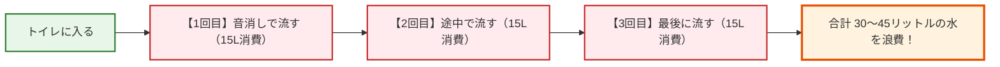

日本の空港や駅、デパートのトイレに初めて入ったとき、こんな不思議な体験をしたことはありませんか？

> 🚗 クルマ：「ふぅ、日本のトイレはウォシュレットもあって綺麗だな〜。……ん？ 壁に<strong>手のひらのマーク</strong>と<strong>『音』</strong>って書かれたボタンがあるぞ？ これは何だろう……？（ポチッ）」
> 
> 🔊 スピーカー：「<strong>ザザーーーーーーッ！ ジャラララララ〜〜〜♪（大音量の流水音）</strong>」
> 
> 🚗 クルマ：「<strong>うわああああっ！？ な、何これ！？ 便器の水は流れてないのに、壁のスピーカーから猛烈な水の音が鳴り響いてる！？ 壊れたの！？ 私、何か緊急ボタンでも押しちゃったの……！？</strong>」

実はこれ、日本を訪れた外国人旅行者が100%と言っていいほど直面する<strong>「日本のトイレビッグミステリー」</strong>のひとつです。

このスピーカーから流れる人工的な流水音マシンは、日本では<strong>「音姫（おとひめ）」</strong>という雅（みやび）な名前で親しまれています。

「便器の水を流すわけでもないのに、なぜわざわざ音だけを鳴らすの？」
今回は、世界を驚かせるこのハイテク装置の誕生秘話と、日本人の<strong>「恥じらいの美学」×「地球に優しい超エコ精神」</strong>のドラマを紐解きます！

---

## 1. そもそも「音姫」って何のためにあるの？

結論から言うと、音姫の目的はたったひとつ。
<strong>「自分がトイレをしているときの音（排泄音）を、外や隣の個室の人に聞かれないようにカモフラージュするため」</strong>です！

海外では「トイレなんだから音がするのは当たり前」「誰が気にするの？」と考える国がほとんどです。

しかし、日本では古くから<strong>「他人に自分の排泄音を聞かれるのは、穴があったら入りたいほど恥ずかしい！」</strong>という強烈な羞恥心（恥じらいの文化）がありました。

実はこの「音消し」の歴史はものすごく古く、なんと<strong>江戸時代（約200年前）</strong>にまで遡ります！

### 🏺 江戸時代のハイテク音消し「音消し壺」
身分の高い武家の女性たちは、トイレの際に恥ずかしい音を消すため、使用人に<strong>「音消し用の水壺（手水鉢）」</strong>から水をちょろちょろと流させ、そのせせらぎの音でかき消していたという記録が残っています。

日本人の「音を消したい」という情熱は、200年以上前から筋金入りだったのです！

---

## 2. 音姫が救った「莫大な水」——誕生の裏にあった社会問題

「じゃあ、音が恥ずかしいなら、本物のトイレの水を何回も流せばいいんじゃない？」

そう思いますよね？
実は、まさにそれこそが<strong>昭和の日本で起きた大問題</strong>だったのです！

1970〜1980年代、オフィスや学校、デパートの女性用トイレでは、排泄音を消すために<strong>「用を足す前に1回、用を足している最中に1回、最後に流すために1回」と、1回のトイレで2〜3回も水を流すのが当たり前</strong>になっていました。

当時の水洗トイレは、1回流すだけで<strong>約15〜20リットル</strong>もの水を消費していました。
3回流せば、なんと<strong>1回あたり45リットル以上もの貴重な水道水</strong>が「音を消すためだけ」に下水へ消えていたのです！

オフィスビルでは水道代が跳ね上がり、夏場に水不足（渇水）が起きると深刻な社会問題になりました。

### 💡 1988年、TOTOの天才的発明「音姫」降臨！
この「女性の恥じらい」と「水資源の浪費」という2つの難問を一挙に解決するために、住宅設備機器メーカーの<strong>TOTO（トートー）</strong>が1988年に開発したのが、擬音装置<strong>「音姫」</strong>でした。

* 「水そのものを流さなくても、<strong>スピーカーからリアルな流水音を25秒間流せば十分</strong>じゃないか！」

このアイデアは大ヒット！
音姫を導入した女子大では、なんと<strong>年間で約300万円以上もの水道代が節約</strong>されたという伝説的なデータも残っています。

今や音姫は、日本の主要な公共トイレのほぼ100%に普及し、地球環境を守る立派な「エコ・インフラ」となっているのです。

---

## 3. 音姫の進化が止まらない！最近のハイテク機能

誕生から35年以上が経ち、現在の日本のトイレの音姫は信じられないほどの進化を遂げています。

1. **非接触センサー（手をかざすだけ）**:
   感染症対策や衛生面から、ボタンを押さなくても「手をかざすだけ」でセンサーが反応して音が流れます。
2. **座ると自動でスタート**:
   便座に座った瞬間に、人の気配を感知して自動で優しい流水音がスタートする親切設計。
3. **音のバリエーション**:
   ただの「ジャー」という水洗音だけでなく、「小川のせせらぎ」「野鳥のさえずり」「ヒーリング音楽」など、リラックスできる自然音がブレンドされています。

---

## 4. 【外国人あるある】一度押したら終わるまで止められない恐怖！？

実は、音姫を体験した外国人が次に陥るのが、この<strong>「止められないパニック」</strong>です！

> 🚗 クルマ：「うわ、間違えてボタン押しちゃった！ うるさいから早く止めなきゃ……あれ！？ <strong>『停止ボタン』がどこにもない！？</strong>」
> 
> （焦ってもう一度手をかざすクルマ）
> 
> 🔊 スピーカー：「<strong>ジャラララララ〜〜〜〜♪（最初からリスタート）</strong>」
> 
> 🚗 クルマ：「<strong>ぎゃあああ！ 止まるどころか最初からやり直したーーーっ！？</strong>」

### ⏱️ なぜ止められないの？「魔の25秒ルール」
実は、音姫の多くは<strong>「日本人の平均的な排泄時間＝約25秒間」</strong>に合わせて自動タイマーがセットされています。
そのため、一度鳴り始めると、基本的には<strong>25秒が経過して自然にフェードアウトするまで強制再生される仕様</strong>になっているものが多いのです！

しかも、途中で「止めよう」と思ってセンサーにもう一度手をかざしたりボタンを押すと、親切設計が裏目に出て<strong>「あ、音を延長したいんですね！ じゃあ最初からもう25秒どうぞ！」</strong>とリピート再生されてしまうという地獄のトラップ……！（笑）

### 🚪 個室から出られない「日本人の気まずい沈黙」
日本人にとってもこれは「あるある」で、用が早く終わったのに音姫がまだ元気に「ジャ〜〜〜」と鳴っているとき：
* 「個室を出たら、手洗い場にいる人に『あ、あの人いま音姫鳴らしてたんだな』とバレて恥ずかしい……！」

という羞恥心が働き、<strong>音がピタッと止まるまでの数秒間、個室の中でじっと息を潜めて待つ</strong>という謎の気まずい時間が発生します。

※最近の最新パネルには「止」ボタンがついているものも増えましたが、壁に単体でついている四角い音姫は<strong>「一度鳴らしたら最後まで付き合う」</strong>のが大人のマナー（？）なのです！

---

## 5. 街角サバイバル！日本のトイレ操作パネル完全攻略

日本のトイレの壁には、宇宙船のコックピットのようにたくさんのボタンが並んでいます。
間違えてパニックにならないよう、基本のアイコンをチェックしておきましょう！

| ボタン表記 / アイコン | 読み方 | 機能 |
| :--- | :--- | :--- |
| 🌊 <strong>流す（大 / 小）</strong> | ながす（だい / しょう） | 便器の水を流す（本物の水） |
| 🔊 <strong>音 / 音姫</strong> | おと / おとひめ | スピーカーから流水音を流す（音のみ） |
| ⏹️ <strong>止（停止）</strong> | とめる / ていし | 温水洗浄や音を途中でストップする |
| 🚿 <strong>おしり</strong> | おしり | おしりを温水で洗う |
| 🌸 <strong>ビデ</strong> | びで | 女性専用の温水洗浄 |
| 💨 <strong>乾燥</strong> | かんそう | 温風でお尻を乾かす |

> 💡 <strong>旅行者のためのワンポイントアドバイス</strong>
> トイレを出るときに「音姫のボタン」を押しても、便器の水は流れません！
> 壁やレバーの<strong>「流す（大 / 小）」</strong>を必ず押してから個室を出てくださいね。

---

## まとめ：恥じらいから生まれた、世界一優しいおもてなし

日本のトイレで川のせせらぎが流れるのは、壊れているからでも、いたずらでもありません。

* 「周りに気兼ねなく、安心して用を足してほしい」という<strong>利用者の心への配慮（おもてなし）</strong>
* 「大切な水資源を一滴も無駄にしない」という<strong>徹底したエコ精神</strong>

この2つが合体して生まれた、日本ならではの温かい知恵なのです。

もし日本のトイレで「音姫」を見かけたら、ぜひ恥ずかしがらずに手をかざして、日本のハイテクおもてなしを体験してみてくださいね！
