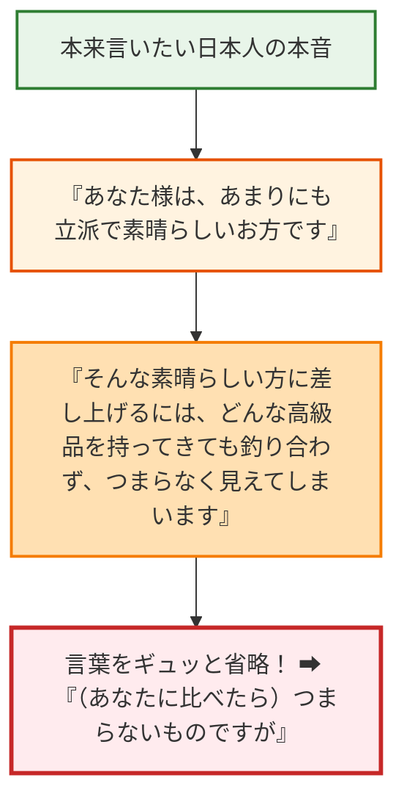

日本の取引先や友人からお土産（手土産）をもらったとき、こんな衝撃的なセリフを聞いたことはありませんか？

> 👨‍💼 日本人：「オスカーさん、これ、<strong>本当につまらないものですが……</strong>どうぞお納めください」
> 
> （――手渡された包みを開けると、桐箱に入ったツヤツヤの<strong>1玉1万円以上する最高級クラウンメロン</strong>！）
> 
> 🚗 クルマ：「<strong>えええええええっ！？ つ、つまらないもの！？ どこからどう見ても銀座の高級フルーツ店の最高級品じゃないですか！？ なんで『つまらない』なんて嘘をつくんですかーーーっ！？</strong>」

海外出身の方なら、思わず**「つまらないなら最初から渡すなー！（笑）」**と心の中で激しくツッコミを入れたくなりますよね。

アメリカやヨーロッパ、あるいは中国や台湾などでは、プレゼントを渡すときは：
* 「これ、私の大好物で絶対に美味しいから食べて！」
* 「あなたのために一番良いものを選んできたよ！」

と、<strong>「贈り物の素晴らしさ」をポジティブにアピールするのが当たり前</strong>です。

それなのに、なぜ日本人はわざわざ時間とお金をかけて選んだ最高の手土産を「つまらないもの」と悪口のように下げて渡すのでしょうか？

今回は、この日本独特の「言葉のあや」の奥にある<strong>「相手への究極のリスペクト」</strong>と、現代の日本で好まれるスマートな手土産表現を解説します！

---

## 1. 「つまらないもの」の本当の意味＝相手を限界まで高めるへりくだり

結論から言うと、「つまらないものですが」の真意は、品物をバカにしているわけではありません。

この言葉の裏には、実は<strong>「言葉を省略した長いメッセージ」</strong>が隠されているのです！

そうなんです！
「このメロンがつまらない」と言っているのではなく、<strong>「あなたという素晴らしい存在の前では、どんな高級メロンもかすんで見えてしまう」という、相手を天高く持ち上げるための「へりくだり（謙譲）」の表現</strong>だったのです。

また、もう一つの理由として**「相手にプレッシャーを与えないための優しさ」**もあります。
「これ、すごく高かったんですよ！ 感謝してくださいね！」と恩着せがましく渡すと、受け取る側も「そんな高価なもの、お返しが大変だな…」と重荷に感じてしまいますよね。

「つまらないものですから、どうかお気兼ねなく受け取ってくださいね」という、相手への精神的な気遣いでもあるのです。

---

## 2. でも実は……最近の日本人でも「使わない人」が急増中！？

相手を思いやる美しい文化から生まれた「つまらないものですが」ですが、実は現代の日本、特に若い世代やイマドキのビジネスシーンでは、<strong>「使わないほうがいい」と考える人が急増</strong>しています！

なぜなら：
* 「一生懸命選んだプレゼントを『つまらない』と言うのは、選んだ自分にも、作ってくれたお店にも失礼ではないか？」
* 「『つまらないもの』と言って渡されたら、受け取る側もあまり嬉しくないのでは？」

という合理的な感覚が広まってきたからです。
ビジネスマナーの本でも、「つまらないものですが」は少し古臭く、人によってはネガティブに捉えられることがあるため、避ける傾向にあります。

---

## 3. これが言えたら上級者！相手も自分もハッピーになる魔法のフレーズ

では、今の日本でプレゼントや手土産をスマートに渡すには、どんな言葉を使えばいいのでしょうか？

相手に負担を感じさせず、かつポジティブな気持ちを伝えられる<strong>「好感度120%の魔法のフレーズ」</strong>を伝授します！

| おすすめフレーズ | ニュアンス・使う場面 | 相手の受け止め方 |
| :--- | :--- | :--- |
| 🌸 <strong>「お口に合うと嬉しいのですが」</strong> | 食べ物・お菓子を渡すときの超定番！一番自然で上品。 | 「気遣いがあって素敵だな」 |
| 🍓 <strong>「こちらの〇〇がとても美味しかったので、ぜひ召し上がっていただきたくて」</strong> | 自分が本当に気に入っている美味しいものをシェアしたいとき。 | 「わざわざ美味しいものを選んでくれたんだ！」 |
| 🎁 <strong>「ほんの気持ちですが」</strong> | カジュアルにもフォーマルにも使える万能クッション言葉。 | 重すぎず軽すぎず、ちょうどいい気配り。 |
| ☕ <strong>「心ばかりのものですが」</strong> | ビジネスで大活躍！謙虚でありながら品格のある大人の表現。 | 「ちゃんとしたマナーを知っている人だな」 |

もし会話で手土産を渡すときは、
> 🗣️「これ、地元ですごく人気のお菓子なんです。<strong>お口に合うと嬉しいのですが、皆さんでどうぞ！</strong>」

と一言添えるだけで、オフィスや友人関係が一瞬で温かい空気に包まれますよ！

---

## まとめ：「つまらないもの」が全然つまらなくない話！

「つまらないものですが」と言いながら、桐箱入りの極上メロンを差し出す日本人。

そう、これはまさに**「『つまらないもの』が全然つまらなくない話」**なのです！

一見するとネガティブで矛盾した言葉に見えますが、その根底には<strong>「自分を控えめにして、相手をどこまでも敬う」という日本人の奥ゆかしい心（へりくだりの美学）</strong>が息づいていました。

* 👂 <strong>「つまらないものですが」と言われたら</strong>: 「私のことをそれほど敬ってくれているんだな」と笑顔で「ありがとうございます！」と喜んで受け取るのが正解！
* 🎁 <strong>自分が手土産を渡すときは</strong>: 「お口に合うと嬉しいのですが」とポジティブな優しさを添えてみるのが現代流！

言葉の裏にある「相手ファースト」の温かい思いやりを知ると、日本でのお土産のやり取りが何倍も楽しく、味わい深くなりますね！
